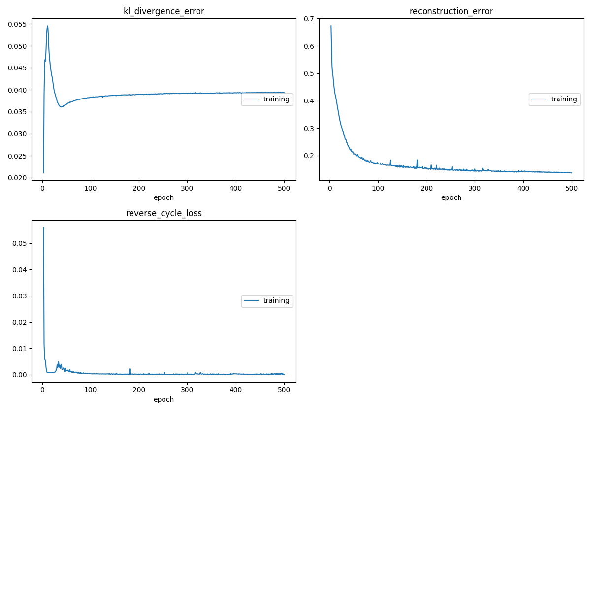

# Cycle Consistent VAEs

This repository contains a PyTorch implementation of the ECCV 2018 Paper, [Disentangling Factors of Variation with Cycle-Consistent Variational Auto-Encoders](https://arxiv.org/abs/1804.10469). For the original implementation of the paper, please refer to the author's implementation [here](https://github.com/ananyahjha93/cycle-consistent-vae).

For further details on the results and analysis, please refer to ```Problem 2``` in the report - ```report.pdf``` 


## Installing Dependencies

Make sure you have a Python3+ version. Run the following command - 

```
pip install -r requirements.txt
```

## Training the Model

### Dataset

Download the __2D Sprites__ dataset from [here](http://www-personal.umich.edu/~reedscot/files/nips2015-analogy-data.tar.gz) and run the following steps - 
- Create a folder named ```./splits/``` in the root folder. 
- Run the code present in ```create_sprites.ipynb``` to read the dataset, and process the images. 
- The code will create train and test splits for the dataset in the ```./splits/```  folder

### Model

The model definition is present in ```cycle_consistent_vae_in.py``` and the training script is present in ```train_512_64_in.py```. 

## Results

### Loss Plots

The loss plots are generated while the training is going on, with the help of the ```livelossplot``` library. 



### Style Transfer

To qualitatively check the disentaglement performance of the model, we transfer the style across different sprites, while keeping their character identity the same. The topmost row contains the images from where the specified features (_s_) is taken, and the first column contains images from where the unspecified features (_z_) is taken. These images have been taken from the Test set.


### Interpolation

For the interpolation plot, the first image (1,1) and the last image (8,8) are actual sprites taken from the Test set. Across the columns, the specified vector (class identification) gets interpolated and across the rows, the unspecified vector (pose identification) gets interpolated.


### Classifiers on the Specified and Unspecified Latent Representations

Attaching a fully connected network on top of the latent representations, the specified representations achieved a test accuracy of __0.67__ and the unspecified features yielded a test accuracy of __0.002__. For further details on the results and analysis, please refer to _Section 2.4 in Page 5_ of the report - ```report.pdf``` .

### Prediction networks on Latent Representations


It can be observed that there are no mis-classifications in the reconstructed batch. This is probably because, unspecified features (like pose) might contain cues about the hair/skin colour and clothes of the sprite, and thus, the class of the sprite can be constructed with the help of the pose. Another reason why this might happen is that for each class, there are multiple poses, thus the data gives better indication for the construction of specified features from the unspecified features.

#### Predicting Specified Representations from Unspecified Representations


It can be observed that all of the reconstructed images are mis-classified for the batch. This is probably because of the one-to-many mapping that is present in the dataset. Each class has multiple poses and thus, given a class representation, it is difficult to pinpoint the exact pose that a sprite of a certain class would have. Thus, even though the poses are not random, they are not the poses corresponding to the original batch. These results re-assert the motivation for the Cyclic VAE architecture, which is to ensure that the specified feature information does not leak into the unspecified feature space.


## License 

Copyright (c) 2020 Aditya Chetan and Brihi Joshi

For license information, see [LICENSE](LICENSE) or http://mit-license.org


- - -

Done by [Aditya Chetan](https://github.com/justachetan) and Brihi Joshi


This code was written as a part of a course group assignment in **Deep Learning** with [Dr. Saket Anand](https://www.iiitd.ac.in/anands) at IIIT Delhi during Winter 2020 Semester.

For bugs in the code, please write to: brihi16142 [at] iiitd [dot] ac [dot] in or aditya16217 [at] iiitd [dot] ac [dot] in
